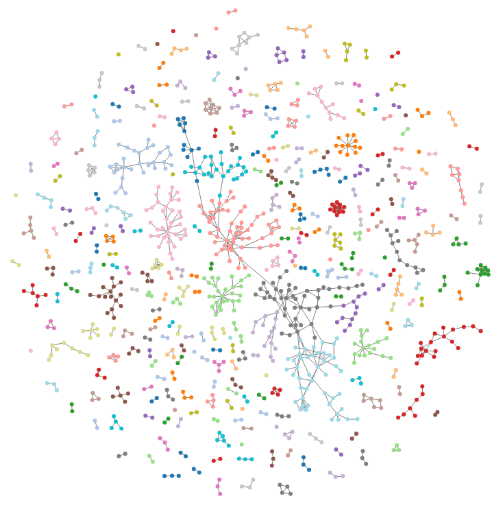

# readme-vis

a look at `README.md` files from [bl.ocks.org](http://bl.ocks.org/) that contain links to other bl.ocks 

see the live example at [http://bl.ocks.org/micahstubbs/8a173cfcb9171627c7f1](http://bl.ocks.org/micahstubbs/8a173cfcb9171627c7f1)

community detection done with the [jLouvain](https://github.com/upphiminn/jLouvain) library

a lineage of bl.ocks that informed this idea:

* [all the blocks](http://bl.ocks.org/enjalot/6ac67b0d8ed673c9aa61) from [enjalot](http://bl.ocks.org/enjalot)
* [Networks - Graphs 7](http://bl.ocks.org/emeeks/f2f6883ac7c965d09b90) from [emeeks](http://bl.ocks.org/emeeks)
* [Blocks Graph](http://bl.ocks.org/curran/1da93bab4cdc708f41ae) from [curran](http://bl.ocks.org/curran)
* [Blocks Graph Edges Only](http://bl.ocks.org/curran/daf6bc9db8b0a28e3973) from [curran](http://bl.ocks.org/curran)
* [Blocks Graph with Links](http://bl.ocks.org/curran/be4a45ec74357e7d9b10) from [curran](http://bl.ocks.org/curran)
* [Dynamic Size](http://bl.ocks.org/curran/db1e524cae5e4344b2e6) from [curran](http://bl.ocks.org/curran)

MIT License